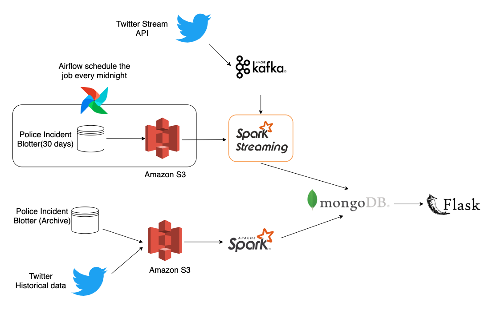

# Witness Finder 

> ***Before the police incident made its way through the court system, it's very helpful to find some potential witnesses of the case for future reference***
***
## Motivation

The city attorney would like to find the witness or proof of the case as soon as possible. Currently, they rely on themselves to do the investigation. The cost of time and money is significant. However, in the time of social media, most of the reported crimes are captured by some witness's smart phone. If we can find these social media posts and associate it with the case, store the result into database. We can provide a web app to the city attorney to find the potential proofs. 

---
## Data Source

  - [Police Incident Blotter (30 Day)](https://data.wprdc.org/dataset/police-incident-blotter)
  - [Police Incident Blotter (Archive)](https://data.wprdc.org/dataset/uniform-crime-reporting-data)
  - [Twitter straming data API](https://developer.twitter.com/en/docs/tutorials/consuming-streaming-data)
---
## System

***Batch Job***: historical twitter data and Police incident blotter (Archive) data are ingested from S3 bucket into Spark. Spark compute whether the incident and the tweet is associated or not. And save the result into the mongoDB. 

***Streaming Job***: real-time tweet data are streamed by Kafka into Spark Streaming, Spark streaming compute whether the incident and the tweet is associated with each other or not. And save the result into the mongoDB.

> Since the Police incident blotter(30 days) is updated daily at midnight. This process is automated with the help of the Airflow scheduler.
>

***Web App***: Provide the API to query the mongoDB given the unique id of the case. It will show you the potential relevant tweets. 

---
## Clusters

- (4 nodes) Spark Cluster - Batch
- (3 nodes) Spark Cluster - Stream
- (3 nodes) Kafka Cluster
- MongoDB node
- Flask Node

12 m4.large AWS EC2 instances are needed. 
